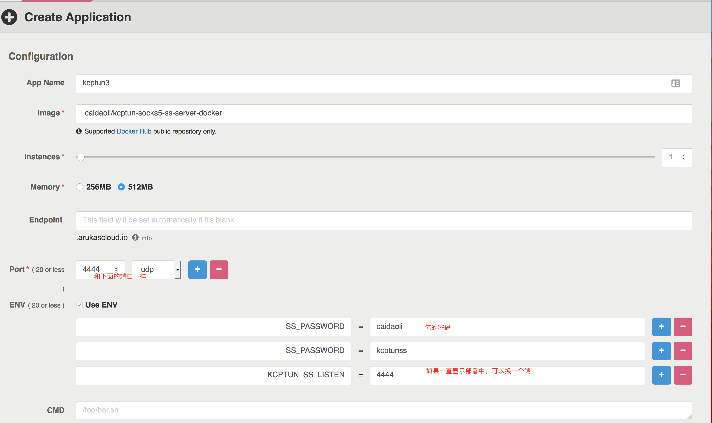

# 利用arukas的api自动获取运行kcptun server的docker的主机地址和端口。镜像仅仅14M


# kcptun Server的密码是password，可以配合 caidaoli/kcptun-socks5-ss-server-docker使用，


####arukas的IP和端口是动态的。应用重启或者其他某些原因，会导致IP端口变化。一般每周甚至一天重启一次。Endpoint 是固定的，但是Endpoint不支持 TCP/UDP协议，只支持HTTP。每次都登录进去查看ip和端口很不爽。
####此docker镜像是利用arukas的api获取json信息，并解析对应的ip和端口，如果发生了变化，就重启kcptun的client来保证服务的持续可用性。检查频率是1分钟一次
	使用此镜像需要设置的环境变量
1. 	Token
2. 	Secret
3. 	Endpoint
4. 	Port
5. 	KcptunKey
6.	KcpPara 


-
####Token和Secret通过 https://app.arukas.io/settings/api-keys 获取。
###Endpoint 是目标容器的Endpoint ，可以通过此 Endpoint 来标识目标容器。
####Port 是目标容器的自定义端口，此端口是创建 docker 时自己填的那个，比如22和8388和80什么的
####KcptunKey 默认为password
####kcptun client的端口为4440
####KcpPara 自定义kcptun参数，
最终运行的命令为
` client -r $addr:$port -mode fast2 -dscp 46 -mtu 1400 -crypt salsa20 $KcpPara -autoexpire 60 -l :4440 -key $KcptunKey `
-
#服务端可以这样设置

-
#电脑上运行
-
docker run --rm -p 4440:4442 -e Token=你的 -e Secret=你的 -e Endpoint=你的.arukascloud.io -e Port=4444 -it caidaoli/arukas-kcptun-client
#ss客户端连接
-
ss-local -s 127.0.0.1 -p 4440 -k "arukas上的密码" -m aes-256-cfb -b 0 -l 9050 -v


然后就可以通过9050访问了 

#也可写成docker-compose.yml
-
```
arukas-kcptun-client:
	image: caidaoli/arukas-kcptun-client
	ports:
		- '4440:4442'
	restart: always
	environment:
		- Token=你的
		- Secret=你的
		- Endpoint=你的.arukascloud.io
		- Port=4444
```